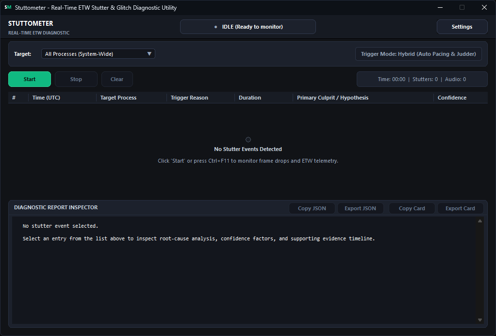
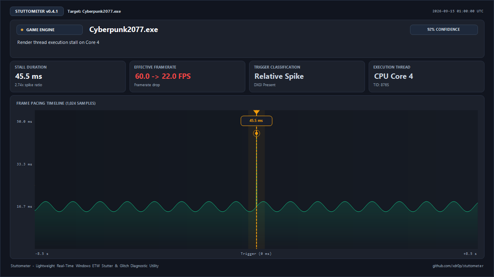
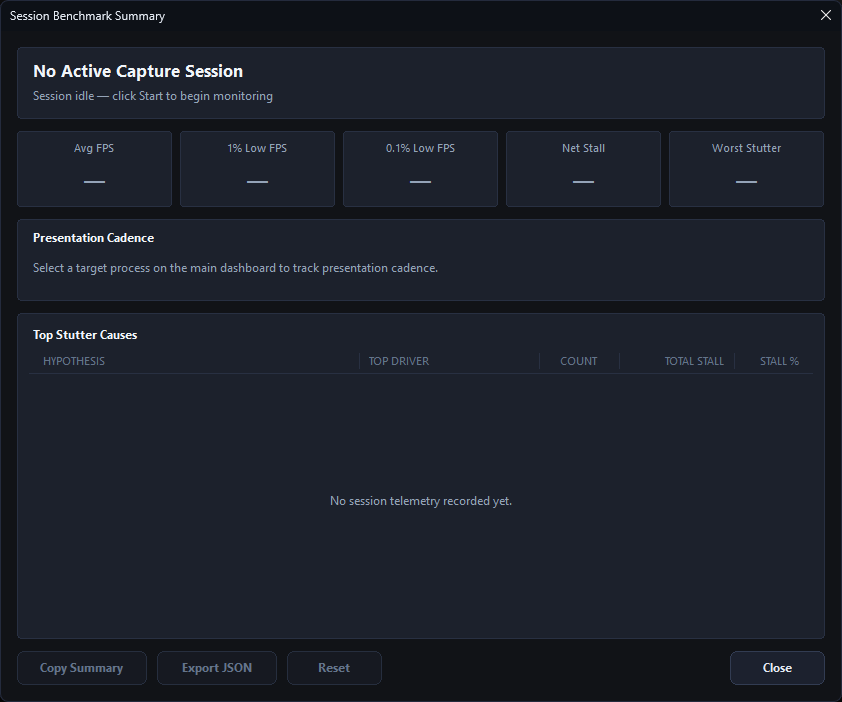
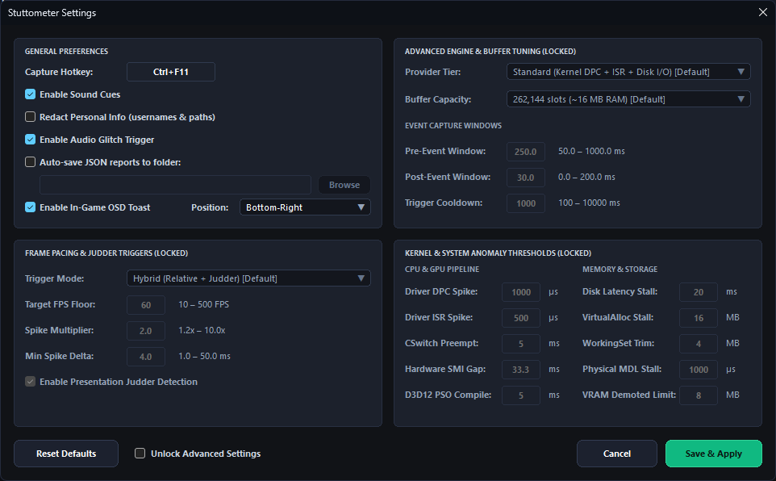

# Stuttometer

Real-time micro-stutter, frame pacing, and audio-glitch diagnosis for Windows games and media apps via Event Tracing for Windows (ETW).



The standard way to diagnose a game stutter is to record a full system trace using WPR (`xperf`) and dig through multi-gigabyte `.etl` files after the fact—which only works if you happened to be recording when the stutter occurred. Stuttometer does the opposite: it traces continuously into a rolling in-memory flight recorder (~23 MB core CLI / ~50 MB full active GUI), and when it detects a frame spike, cadence judder, compositor glitch, or audio dropout, it freezes that capture window, correlates the surrounding events across kernel, GPU, disk, memory, and audio subsystems, and writes a structured JSON diagnosis.

Leave it running in the background; when a stutter happens, the evidence is already captured.

> **Note:** Stuttometer is a diagnostic and troubleshooting tool with built-in session benchmarking. It is not an in-game overlay, frame limiter, or permanent ETL trace recorder.

---

## How It Works

- **Zero-Allocation Flight Recorder:** Events stream into a pre-allocated lock-free ring buffer (262,144 slots × 64 bytes, one seqlock per slot). No heap allocations occur while tracing is active, preventing diagnostic overhead from inducing its own DPCs or memory pressure.
- **Active ETW Flushing:** A dedicated worker thread issues kernel flush commands (`ControlTraceW` with `EVENT_TRACE_CONTROL_FLUSH`) every 100 ms (configurable down to 25–50 ms) so events reach the flight recorder with minimal delivery latency. Periodic clock resynchronization bounds the age of the last UTC↔QPC snapshot to ≤ 3 seconds + flush interval (default: ~3.1 seconds), ensuring tear-free alignment between wall-clock timestamps and hardware query performance counters.
- **Hybrid Trigger Engine:** Tracks a moving-median frametime baseline to catch relative spikes (`--spike-multiplier`) and detects cadence variance ("judder")—the micro-stutters that never cross a fixed millisecond threshold. Static and dynamic trigger modes are also supported.
- **Three-Tier Presentation Timing:**
  - `Microsoft-Windows-DxgKrnl` (`MMIOFlip` / `FlipEvent` / `PresentStop`) — hardware flip completion events (DirectX 12, Vulkan, DirectX 11).
  - `Microsoft-Windows-DXGI` — CPU-side Present submission latency to isolate API bottlenecks from GPU delivery stalls.
  - `Microsoft-Windows-Dwm-Core` — desktop compositor schedule glitches with kernel-side keyword filtering. Rapid successive glitches within 50 ms are tagged with `DWM_GLITCH_DEDUPLICATED` (`0x0800`) and parsed completely with accurate durations.
- **Audio Underrun Detection:** Subscribes to `Microsoft-Windows-Audio` (Event ID 11) to capture audio dropouts and crackling.

---

## Root-Cause Correlation

When a trigger fires, Stuttometer saves a window around the stutter (e.g. 250 ms pre-trigger + 30 ms post-trigger) and correlates the events across multiple subsystems:

| Subsystem Signal | What It Detects / Correlates |
| :--- | :--- |
| **ISR / DPC Spikes** | Long-running interrupt routines and offending drivers (`amdkmdag.sys`, `nvlddmkm.sys`, `ndis.sys`, `storport.sys`, etc.) |
| **D3D12 Pipeline State Creation** | Synchronous runtime shader compilation stalls (`D3D12CreatePipelineState`) |
| **GPU VRAM Paging & Demotion** | VidMm budget overcommit, memory thrashing, and resource demotions |
| **Synchronous Memory Stalls** | Slow `VirtualAlloc` commits, MDL physical allocations, and aggressive working set trims |
| **Synchronous Disk I/O** | File reads/writes blocking execution beyond latency thresholds |
| **Context Switch Preemption** | Thread descheduling and CPU starvation during active frame delivery |
| **Hardware / SMI Stalls** | Firmware execution pauses (System Management Interrupts) where CPU execution was suspended |

Every trigger report produces a structured JSON output with ranked probable causes, confidence scores (0.0 to 1.0), and a supporting evidence timeline.

---

## Memory Footprint & Resource Impact

Stuttometer is engineered for continuous background monitoring during active gameplay. All telemetry structures are pre-allocated at startup so that **zero runtime heap allocations** occur while tracing is active, ensuring the diagnostic tool never induces garbage collection pauses, working set paging, or frametime spikes itself.

### Real-World Working Set (Task Manager)

| Operating State | Working Set (RAM) | CPU Overhead | Subsystems Active |
| :--- | ---:| ---:| :--- |
| **Idle GUI (Waiting)** | **~20.8 MB** | 0.0% | Standalone Win32 Common Controls dashboard, fonts, and dark theme cache |
| **Active Tracing (GUI Dashboard)** | **~49.6 MB** | < 0.2% | Full telemetry flight recorder, continuous frame pacing ring, in-flight tables & ETW kernel buffers |
| **CLI Diagnostic (`stuttometer.exe`)** | **~23.4 MB** | < 0.1% | Headless diagnostic flight recorder and in-flight tracking tables (zero GUI overhead) |

### Internal Telemetry Allocation Breakdown

| Telemetry Subsystem | Resident Allocation | Implementation Architecture |
| :--- | ---:| :--- |
| **Diagnostic Flight Recorder** | 16.78 MB | 262,144 slots × 64 bytes (`Slot` cache-line aligned seqlocks) |
| **Session Benchmark Pacing Buffer** | 16.78 MB | 262,144 slots × 64 bytes (`FrameSlot` cache-line aligned seqlocks) |
| **In-Flight Tracking Tables** | 6.61 MB | 9 pre-allocated lock-free open-addressing hash tables |
| **ETW Consumer Buffers & Win32 GUI** | ~9.5 MB | Kernel-mapped consumer pages, GDI objects, and control state |
| **Total Active Working Set** | **~49.6 MB** | Completely flat memory usage throughout long gaming sessions |

Buffer capacity can be adjusted with `--buffer-slots` (65,536 to 1,048,576).

---

## Building

### Prerequisites
- Windows 10 or Windows 11 (x64)
- Visual Studio 2022 (MSVC C++20) with C++ Desktop workload
- CMake 3.25+

```powershell
# Configure CMake
cmake -S . -B build

# Build Release binaries
cmake --build build --config Release

# (Optional) Run unit test suite
ctest --test-dir build -C Release --output-on-failure
```

The build produces two executables:
- `build\Release\stuttometer_gui.exe` (Standalone Win32 GUI dashboard)
- `build\Release\stuttometer.exe` (Command-line diagnostic utility)

---

## Desktop GUI (`stuttometer_gui.exe`)

Stuttometer includes a standalone native Win32 GUI (~1.2 MB) built on Common Controls v6 with zero external runtime dependencies.

- **Stutter Inspector:** Live report feed with ranked root-cause diagnoses, confidence score meters, and evidence timelines.
- **Visual Stutter Card:** Export high-resolution diagnostic cards (PNG) or copy directly to clipboard (`CF_DIB` format) for seamless `Ctrl+V` pasting into Discord, Slack, Reddit, GitHub issues, and community forums.

  

- **In-Game OSD Toast:** Non-intrusive on-screen notification (`WS_EX_TOPMOST | WS_EX_NOACTIVATE | WS_EX_LAYERED | WS_EX_TRANSPARENT`) displaying stall duration, attribution tag, culprit driver/module, and diagnosis summary when a stutter occurs, without stealing game focus or input. *Note: OSD notifications are suppressed by hardware fullscreen-exclusive presentations; use borderless-windowed mode to receive in-game notifications.*
- **Process Picker:** Discovers running graphical games and applications via `EnumWindows`.
- **Live Activity Feed:** Visualizes real-time frametimes, DPC/ISR spikes, disk I/O, and memory events.
- **Export & Privacy:** One-click JSON report export and clipboard copying, with a toggleable `--redact` mode to sanitize process names, file paths, and usernames. Unquoted path redaction operates conservatively: it scans without an arbitrary length bound until a delimiter (`\n`, `\r`, `\t`, `"`, `'`, `` ` ``, `,`, `;`, `]`, `}`, `>`, `<`) or end of string; trailing unquoted prose without an intervening delimiter is conservatively over-redacted into `[PATH_REDACTED]`; and exotic pathnames containing unquoted commas or brackets should be enclosed in quotes.

```powershell
.\build\Release\stuttometer_gui.exe
```

### Session Benchmark Mode

Click **Session Summary** in the top header to inspect real-time, session-wide frame pacing metrics and cumulative root-cause attribution:



- **Continuous Lock-Free Ingestion:** Ingests every delivered frame (DXGI Present and Kernel Flip with canonical warm-up fallback) into a dedicated 262,144-slot seqlock ring buffer with zero runtime allocations.
- **Pacing Metrics:** Computes mathematically rigorous Average FPS, 1% Low FPS, 0.1% Low FPS, and cumulative Net Stall Time.
- **Cumulative Root-Cause Attribution:** Ranks cumulative stall time across diagnostic subsystems (DPC/ISR, Shader Compilation, VRAM Paging, Context Switches, etc.) and isolates offending driver modules (`dxgkrnl.sys`, `nvlddmkm.sys`, etc.).
- **Pause & Loading Screen Filtering:** Frames $\ge 10\text{s}$ (alt-tabs, level loads) are automatically ignored so benchmarks reflect genuine active gameplay.
- **Export & Share:** One-click Markdown summary copying and structured JSON export.

### Settings & Configuration

Fine-tune buffer capacity, pre/post capture windows, trigger modes (hybrid/judder/static), audio glitch detection, and per-subsystem anomaly thresholds directly from the UI:



---

## CLI Usage

Live capture requires an elevated terminal (`Run as Administrator`):

```powershell
# Basic capture with default hybrid triggering:
.\build\Release\stuttometer.exe --output stutto_report.json

# Target a specific game executable:
.\build\Release\stuttometer.exe --target-process Game.exe --output-dir reports

# Target a specific Process ID:
.\build\Release\stuttometer.exe --target-pid 12345 --output-dir reports
```

### CLI Options

```text
Capture Window:
  --window-ms FLOAT               Pre-trigger window duration in ms (50.0-1000.0, default: 250.0)
  --post-trigger-ms FLOAT         Post-trigger capture duration in ms (0.0-200.0, default: 30.0)
  --cooldown-ms FLOAT             Minimum cooldown between reports in ms (100.0-10000.0, default: 1000.0)
  --buffer-slots INT              Ring buffer capacity in slots (65536-1048576, default: 262144)

Trigger Configuration:
  --trigger-mode TEXT             Frame trigger mode: hybrid, dynamic, static (default: hybrid)
  --present-threshold-ms FLOAT    Static Present stutter threshold in ms (2.0-200.0, default: 16.67)
  --spike-multiplier FLOAT        Relative stutter spike multiplier (1.2-10.0, default: 2.0)
  --min-spike-delta-ms FLOAT      Minimum absolute spike delta in ms (1.0-50.0, default: 4.0)
  --judder-detection / --no-judder Enable/disable cadence judder detection (default: enabled)
  --judder-swing-ratio FLOAT      Judder cadence swing threshold ratio (0.1-0.9, default: 0.35)
  --audio-trigger / --no-audio    Enable/disable AudioGlitch Event ID 11 trigger (default: enabled)

Subsystem Anomaly Thresholds:
  --dpc-threshold-us INT          DPC anomaly threshold in microseconds (100-50000, default: 1000)
  --isr-threshold-us INT          ISR anomaly threshold in microseconds (50-50000, default: 500)
  --disk-threshold-ms INT         Disk latency anomaly threshold in ms (1-1000, default: 20)
  --cswitch-threshold-ms INT      Context switch preemption threshold in ms (1-500, default: 5)
  --smi-threshold-ms FLOAT        Hardware SMI stall threshold in ms (10.0-100.0, default: 33.3)
  --d3d12-pso-threshold-ms INT    D3D12 PSO compilation threshold in ms (1-500, default: 5)
  --vram-threshold-mb INT         GPU VRAM demotion anomaly threshold in MB (1-1024, default: 8)
  --mem-alloc-threshold-mb INT    VirtualAlloc commit stall threshold in MB (1-1024, default: 16)
  --mem-trim-threshold-mb INT     Working set out-swap trim threshold in MB (1-1024, default: 4)
  --mem-physical-latency-us INT   Physical memory allocation latency in microseconds (50-50000, default: 1000)

Targeting, Output & General:
  --target-pid INT                Target Process ID to monitor (default: 0 = monitor all)
  --target-process TEXT           Target process name substring (e.g. Game.exe; attaches to first matching instance)
  --output PATH                   Output file path for single JSON report
  --output-dir PATH               Directory to save individual trigger reports (auto-saves paired JSON and CSV capped to 100 latest)
  --export-csv PATH               Export frame pacing timeline to CSV (overwritten on each trigger; use --output-dir for per-trigger files)
  --dump-events PATH              Stream real-time ETW events to NDJSON file (or - for stdout; can be combined with --output-dir)
  --dump-max-mb INT               Maximum size per NDJSON file before rotation in MB (10-1024, default: 100; ignored when --dump-events is -)
  --dump-max-files INT            Maximum number of rotated NDJSON files to retain (1-10, default: 3; ignored when --dump-events is -)
  --max-reports INT               Maximum number of reports before exiting (default: 0 = continuous)
  --tier TEXT                     Provider tier: minimal, standard, full (default: standard)
  --redact                        Redact process names, file paths, and user identifiers (conservative unquoted delimiter scan; quote exotic paths)
  --verbose                       Print detailed event stream metrics to console
  --version                       Print version information and exit
  --self-check                    Run non-destructive environment diagnostics & ETW provider checks, then exit
```

### Real-Time Event Streaming (NDJSON)

Stuttometer supports real-time event streaming via `--dump-events <path|- >`:
- **Stdout Streaming (`--dump-events -`):** Emits newline-delimited JSON (NDJSON) to standard output. When active, all non-event diagnostic logging is redirected to `stderr`, and stdout is set to binary mode. Can be combined with `--output-dir <dir>` to capture per-trigger reports to disk while streaming raw events.
- **Categorized Event Stream:** The stream captures all actionable stall categories (DXGI presents, audio glitches, DPC/ISR spikes, Disk I/O, context switches, DWM glitches, page faults, CPU throttling, antimalware scans, D3D12 PSO compilation, VRAM paging, and kernel memory allocations). High-frequency non-stall API trace events (such as per-draw D3D12 calls) are filtered to ensure high signal-to-noise ratio and zero consumer ring buffer saturation.
- **NDJSON Schema (v1):**
  ```json
  {"v":1,"ts_qpc":123456789,"cat":"DXGI","id":43,"pid":4568,"tid":8912,"cpu":2,"dur_us":16670,"aux":0,"flags":0}
  ```
  `dur_us` is `0` for instant/start events; consumers distinguish start vs. stop by `cat` and event `id`. Disk Init events carry `"aux": 0` rather than leaking kernel virtual addresses (KVA), while completed I/O byte counts remain in `aux` on Stop events.
- **Zero Idle CPU & Latency Trade-Off:** The background NDJSON writer drops idle CPU to 0% via escalating backoff (64 pauses, 64 yields, then 2 ms wait on a condition variable); under active event flow, events stream immediately with zero additional latency.
- **PowerShell / `jq` Piping Example:**
  ```powershell
  # Stream events and filter DXGI presents in real time
  .\build\Release\stuttometer.exe --dump-events - --max-reports 1 | jq 'select(.cat == "DXGI")'
  ```

### Frame Pacing CSV Export & Auto-Save Retention

- `--export-csv <path>` writes the retained frame pacing timeline in RFC 4180 CRLF format.
- When `--output-dir <dir>` is specified, Stuttometer automatically writes both `stutto_report_<count>_<qpc>.json` (JSON Schema v1.1) and `stutto_pacing_<count>_<qpc>.csv` for every trigger, applying an automated 100-file rolling retention cap per prefix.

---

## Design Notes

- **Zero Allocation During Active Tracing:** A diagnostic utility that dynamically allocates memory mid-trace risks triggering its own page faults, DPCs, and thread preemptions, distorting the very latency it is trying to observe. All ring slots and in-flight hash tables are pre-allocated at startup.
- **Fixed-Size Dashboard Layout (1020×660 @ 96 DPI, DPI-Scaled):** The GUI dashboard is hand-tuned to present dense telemetry data without horizontal/vertical scrollbars or awkward control clipping. `ptMaxTrackSize` equals `ptMinTrackSize` to guarantee a clean layout.
- **UAC Manifest on the GUI:** Real-time kernel ETW sessions require `SeSystemProfilePrivilege`. Elevating once via application manifest on launch avoids mid-session failures and secondary restart prompts.

---

## Limitations

- **Platform & Privileges:** Windows 10/11 x64 only. Live tracing strictly requires administrator privileges.
- **In-Game OSD Presentation:** OSD notifications are suppressed by hardware fullscreen-exclusive presentations; use borderless-windowed mode to receive in-game notifications.
- **Heuristic Confidence:** Root-cause rankings are probabilistic correlation heuristics designed as high-signal starting points for investigation.
- **Scope:** Stuttometer identifies root causes and isolates culpable subsystems; it does not alter driver behavior, inject into game processes, or modify system scheduler priorities.

---

## License

This project is licensed under the **GNU General Public License v3.0** (GPLv3). See the [LICENSE](LICENSE) file for the full text.

