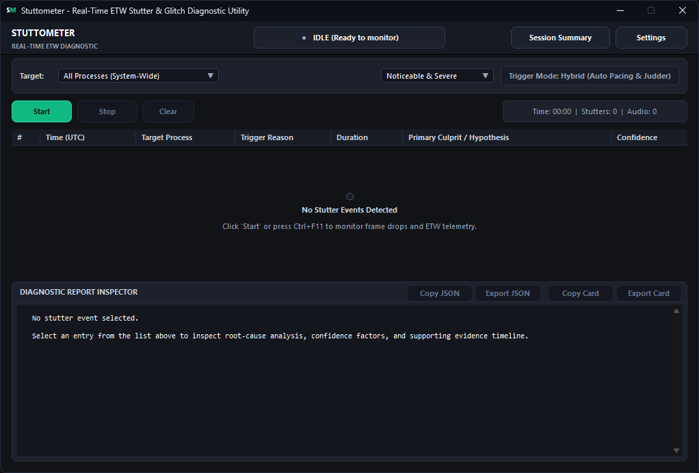
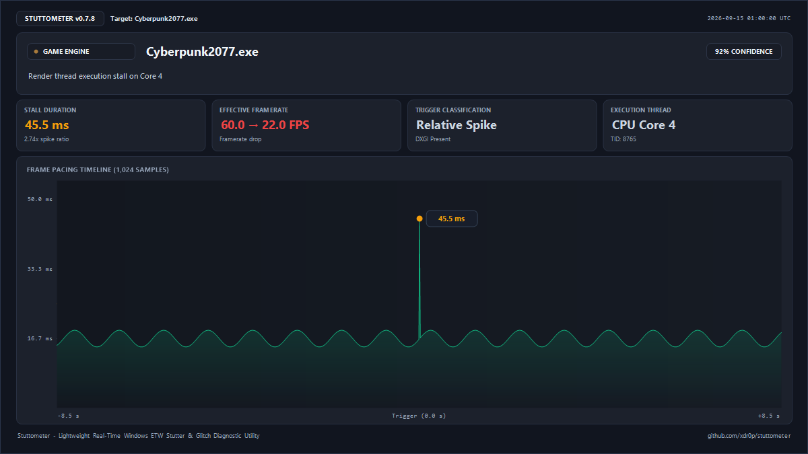
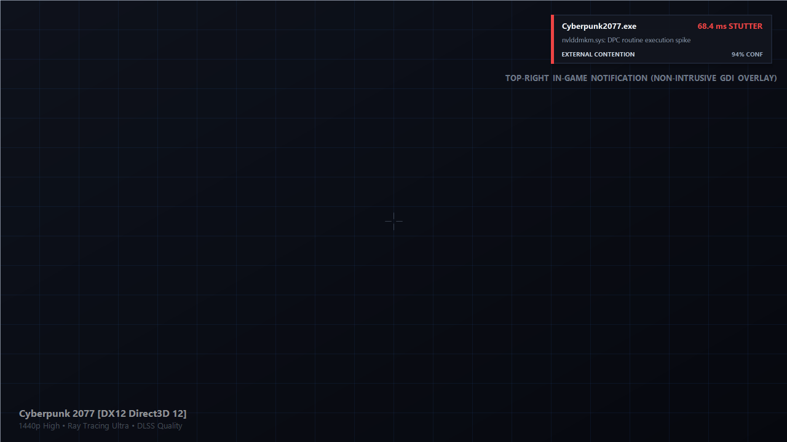
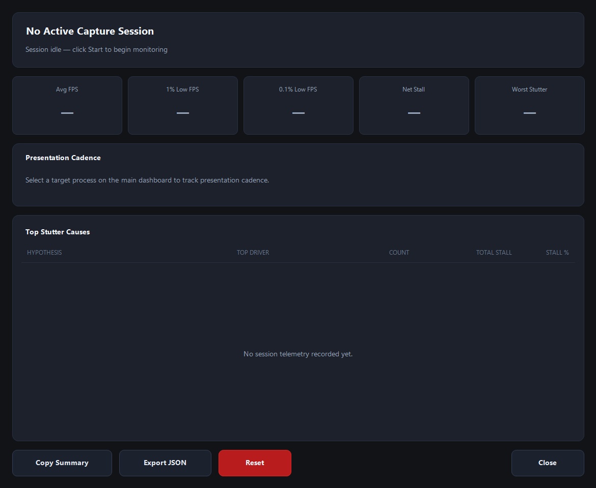
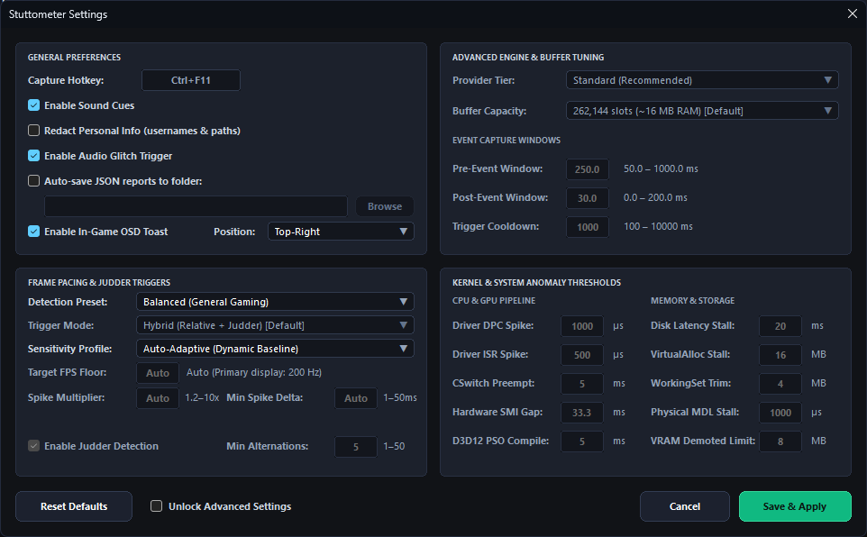

# Stuttometer

Real-time micro-stutter, frame pacing, and audio-glitch diagnosis for Windows games and media apps via Event Tracing for Windows (ETW).



The standard way to diagnose a game stutter is to record a full system trace using WPR (`xperf`) and dig through multi-gigabyte `.etl` files after the fact—which only works if you happened to be recording when the stutter occurred. Stuttometer does the opposite: it traces continuously into a rolling in-memory flight recorder (~23–24 MB core CLI / ~48–50 MB full active GUI), and when it detects a frame spike, cadence judder, compositor glitch, or audio dropout, it freezes that capture window, correlates the surrounding events across kernel, GPU, disk, memory, and audio subsystems, and writes a structured JSON diagnosis.

Leave it running in the background; when a stutter happens, the evidence is already captured.

> **Note:** Stuttometer is a diagnostic and troubleshooting tool with built-in session benchmarking. Not a full in-game overlay; an optional non-activating diagnostic OSD toast is available.

---

## Quick Start

```powershell
# 1. Build Release binaries
cmake -S . -B build
cmake --build build --config Release

# 2. Run non-destructive environment & ETW provider diagnostics
.\build\Release\stuttometer.exe --self-check

# 3. Launch the desktop GUI (requests elevation via UAC manifest)
.\build\Release\stuttometer_gui.exe

# Or start headless CLI capture (requires elevated terminal)
.\build\Release\stuttometer.exe --output stutto_report.json
```

---

## How It Works

- **Zero-Allocation Flight Recorder:** Events stream into a pre-allocated lock-free ring buffer (262,144 slots × 64 bytes, one seqlock per slot). No heap allocations on the ETW hot path (`FlightRecorder::push`, `FixedInFlightTable`, `FilteredEventRing`, `SessionBenchmark::ingest_frame`). Report correlation and export occur off the hot path and may allocate.
- **Active ETW Flushing:** A dedicated worker thread issues kernel flush commands (`ControlTraceW` with `EVENT_TRACE_CONTROL_FLUSH`) every 100 ms (internally configurable via `EtwSessionConfig::flush_interval_ms`; not exposed through CLI or GUI) so events reach the flight recorder with minimal delivery latency. Periodic clock resynchronization bounds the age of the last UTC↔QPC snapshot to ≤ 3 seconds + flush interval (default: ~3.1 seconds), ensuring tear-free alignment between wall-clock timestamps and hardware query performance counters.
- **Dynamic Display Refresh & VBlank Cadence:** Automatically queries the active monitor's physical refresh rate (Hz) and vblank interval (ms) via Win32 display APIs for the target game window, dynamically scaling Present stutter thresholds, DWM compositor glitch evaluations, and hardware SMI stall limits to the hardware cadence (e.g. 4.17 ms at 240 Hz, 6.94 ms at 144 Hz, 16.67 ms at 60 Hz).
- **Hybrid Trigger Engine:** Tracks a zero-allocation rolling-mean frametime baseline with outlier quarantine and dynamic cadence adaptation to catch relative spikes (`--spike-multiplier`) and detects cadence variance ("judder")—the micro-stutters that never cross a fixed millisecond threshold. Static and dynamic trigger modes are also supported.
- **Three-Tier Presentation Timing:**
  - `Microsoft-Windows-DxgKrnl` (`MMIOFlip` / `FlipEvent` / `PresentStop`) — hardware flip completion events (DirectX 12, Vulkan, DirectX 11).
  - `Microsoft-Windows-DXGI` — CPU-side Present submission latency to isolate API bottlenecks from GPU delivery stalls.
  - `Microsoft-Windows-Dwm-Core` — desktop compositor schedule glitches with provider-side keyword filtering. Rapid successive glitches within 50 ms are tagged with `DWM_GLITCH_DEDUPLICATED` (`0x0800`) and parsed completely with accurate durations synthesized from missed vblanks.
- **Audio Underrun Detection:** Subscribes to `Microsoft-Windows-Audio` (Event ID 11) to capture audio dropouts and crackling.

---

## Root-Cause Correlation

When a trigger fires, Stuttometer saves a window around the stutter (e.g. 250 ms pre-trigger + 30 ms post-trigger) and correlates the events across multiple subsystems:

| Subsystem Signal | What It Detects / Correlates |
| :--- | :--- |
| **ISR / DPC Spikes** | Long-running interrupt routines and offending drivers (`amdkmdag.sys`, `nvlddmkm.sys`, `ndis.sys`, `storport.sys`, etc.) |
| **D3D12 Pipeline State Creation** | Synchronous runtime shader compilation stalls (`D3D12CreatePipelineState`) |
| **GPU VRAM Paging & Demotion** | VidMm budget overcommit, memory thrashing, and resource demotions |
| **Synchronous Memory Stalls** | Slow `VirtualAlloc` commits, MDL physical allocations, and aggressive working set trims |
| **Synchronous Disk I/O** | File reads/writes blocking execution beyond latency thresholds |
| **Context Switch Preemption** | Thread descheduling and CPU starvation during active frame delivery |
| **Hardware / SMI Stalls** | Firmware execution pauses (System Management Interrupts) where CPU execution was suspended |

Every trigger report produces a structured JSON output with ranked probable causes, confidence scores (0.0 to 1.0), and a supporting evidence timeline.

---

## Memory Footprint & Resource Impact

Stuttometer is engineered for continuous background monitoring during active gameplay. All telemetry structures are pre-allocated at startup so that **zero runtime heap allocations** occur on the ETW hot path, ensuring the diagnostic tool never induces garbage collection pauses, working set paging, or frametime spikes itself during tracing.

### Real-World Working Set (Task Manager)

| Operating Mode | Working Set (RAM) | CPU Overhead | Use Case / Architecture |
| :--- | ---:| ---:| :--- |
| **Desktop GUI (`stuttometer_gui.exe`)** | **~48–50 MB** | 0.0% – 0.3% | Full interactive dashboard, stutter inspector, session benchmark, & OSD toast |
| **CLI Diagnostic (`stuttometer.exe`)** | **~23–24 MB** | < 0.1% | Headless diagnostic flight recorder and in-flight tracking tables (zero GUI overhead) |

*(Note: Prior to starting an active capture session, the standalone GUI idle footprint is ~20 MB).*

### Internal Telemetry Allocation Breakdown

<details>
<summary>View internal memory allocation breakdown</summary>

| Telemetry Subsystem | Resident Allocation | Implementation Architecture |
| :--- | ---:| :--- |
| **Diagnostic Flight Recorder** | 16 MiB | 262,144 slots × 64 bytes (`Slot` cache-line aligned seqlocks; 16,777,216 bytes) |
| **Session Benchmark Pacing Buffer** | 16 MiB | 262,144 slots × 64 bytes (`FrameSlot` cache-line aligned seqlocks; 16,777,216 bytes) |
| **In-Flight Tracking Tables** | 6.61 MB | 9 pre-allocated lock-free open-addressing hash tables |
| **ETW Consumer Buffers & Win32 GUI** | ~8–10 MB | Kernel-mapped consumer pages (capped at 8 MB per session: 128 KB × 64 buffers, not all committed up front), GDI objects, and control state |
| **Total Active Working Set** | **~48–50 MB** | Highly stable memory working set throughout long gaming sessions |

Buffer capacity can be adjusted with `--buffer-slots` (65,536 to 1,048,576).

</details>

---

## Building

### Prerequisites
- Windows 10 or Windows 11 (x64)
- Visual Studio 2022 (MSVC C++20) with C++ Desktop workload
- CMake 3.25+

```powershell
# Configure CMake
cmake -S . -B build

# Build Release binaries
cmake --build build --config Release

# (Optional) Run unit test suite
ctest --test-dir build -C Release --output-on-failure
```

The build produces two executables:
- `build\Release\stuttometer_gui.exe` (Standalone Win32 GUI dashboard)
- `build\Release\stuttometer.exe` (Command-line diagnostic utility)

---

## Desktop GUI (`stuttometer_gui.exe`)

Stuttometer includes a standalone native Win32 GUI built on Common Controls v6 with zero external runtime dependencies.

- **Stutter Inspector:** Live report feed with ranked root-cause diagnoses, confidence percentages, and evidence timelines.
- **Visual Stutter Card:** Export high-resolution diagnostic cards (PNG) or copy directly to clipboard (`CF_DIB` format) for seamless `Ctrl+V` pasting into Discord, Slack, Reddit, GitHub issues, and community forums.

  

- **In-Game OSD Toast:** Non-intrusive on-screen notification (`WS_EX_TOPMOST | WS_EX_NOACTIVATE | WS_EX_LAYERED | WS_EX_TRANSPARENT`) displaying stall duration, attribution tag, culprit driver/module, and diagnosis summary when a stutter occurs, without stealing game focus or input. *(Note: In-game notifications may be suppressed by some games running in exclusive fullscreen mode; borderless-windowed mode is recommended for guaranteed visibility).*

  
- **Process Picker:** Discovers running graphical games and applications via `EnumWindows`.
- **Global Hotkey:** `Ctrl+F11` toggles background trace capture on and off on demand during active gameplay.
- **Stutter Event List & Diagnostic Inspector:** Chronological list of detected stutters with severity, duration, trigger reason, and top hypothesis; the inspector shows full evidence timeline and engine diagnostics.
- **Export & Privacy:** One-click JSON report export and clipboard copying, with a toggleable `--redact` mode to sanitize process names, file paths, and usernames. Unquoted path redaction operates conservatively: it scans without an arbitrary length bound until a delimiter (`\n`, `\r`, `\t`, `"`, `'`, `` ` ``, `,`, `;`, `]`, `}`, `>`, `<`) or end of string; trailing unquoted prose without an intervening delimiter is conservatively over-redacted into `[PATH_REDACTED]`; and exotic pathnames containing unquoted commas or brackets should be enclosed in quotes.

```powershell
.\build\Release\stuttometer_gui.exe
```

### Session Benchmark Mode

Click **Session Summary** in the top header to inspect real-time, session-wide frame pacing metrics and cumulative root-cause attribution:



- **Continuous Lock-Free Ingestion:** Ingests every delivered frame (DXGI Present and Kernel Flip with canonical warm-up fallback) into a dedicated 262,144-slot seqlock ring buffer with zero runtime allocations.
- **Pacing Metrics:** Computes mathematically rigorous Average FPS, 1% Low FPS, 0.1% Low FPS, and cumulative Net Stall Time. *(Note: 1% Low requires ≥ 100 valid frames and 0.1% Low requires ≥ 1,000 valid frames; otherwise displayed as N/A).*
- **Cumulative Root-Cause Attribution:** Ranks cumulative stall time across diagnostic subsystems (DPC/ISR, Shader Compilation, VRAM Paging, Context Switches, etc.) and isolates offending driver modules (`dxgkrnl.sys`, `nvlddmkm.sys`, etc.). *(Note: Session-wide attribution stats require at least one correlated trigger report).*
- **Pause & Loading Screen Filtering:** Frames $\ge 2\text{s}$ (alt-tabs, level loads) are automatically ignored so benchmarks reflect genuine active gameplay.
- **Export & Share:** One-click Markdown summary copying and structured JSON export.

### Settings & Configuration

Fine-tune buffer capacity, pre/post capture windows, trigger modes (hybrid/dynamic/static) plus a separate judder detection toggle, audio glitch detection, and per-subsystem anomaly thresholds directly from the UI:



---

## CLI Usage

Live capture requires an elevated terminal (`Run as Administrator`):

```powershell
# Basic capture with default hybrid triggering:
.\build\Release\stuttometer.exe --output stutto_report.json

# Target a specific game executable:
.\build\Release\stuttometer.exe --target-process Game.exe --output-dir reports

# Target a specific Process ID:
.\build\Release\stuttometer.exe --target-pid 12345 --output-dir reports
```

### CLI Options

```text
Capture Window:
  --window-ms FLOAT               Pre-trigger window duration in ms (default: 250) [50 - 1000]
  --post-trigger-ms FLOAT         Post-trigger capture duration in ms (default: 30) [0 - 200]
  --cooldown-ms FLOAT             Minimum cooldown between reports in ms (default: 1000) [100 - 10000]
  --buffer-slots INT              Ring buffer capacity in slots (default: 262144) [65536 - 1048576]

Detection:
  -p, --preset TEXT               Detection preset: balanced, competitive, conservative, forensic, custom (default: balanced)
  --min-report-severity TEXT      Minimum severity to trigger a correlated report: all, warning, danger (preset-dependent, balanced: warning)
  --osd-min-severity TEXT         Minimum severity for in-game OSD toast: all, warning, danger (default: danger)
  --judder-min-alternations INT   Minimum alternations to trigger judder episode (preset-dependent, balanced: 5) [1 - 50]
  --trigger-mode TEXT             Frame trigger mode: hybrid, dynamic, static (default: hybrid)
  --pacing-profile TEXT           Pacing sensitivity profile: auto, high-refresh, conservative (default: auto)
  --high-refresh                  Alias for --pacing-profile high-refresh
  --present-threshold-ms FLOAT    DXGI Present stutter threshold in ms (default: auto-detected vblank, e.g. 16.67 at 60Hz) [2 - 200]
  --spike-multiplier FLOAT        Relative stutter spike multiplier (default: 2.0) [1.2 - 10]
  --min-spike-delta-ms FLOAT      Minimum absolute spike delta in ms (default: 4.0) [1 - 50]
  --judder-detection, --no-judder Enable/disable cadence judder detection (default: enabled)
  --judder-swing-ratio FLOAT      Judder cadence swing threshold ratio (preset-dependent, balanced: 0.50) [0.1 - 1]
  --audio-trigger, --no-audio     Enable/disable AudioGlitch Event ID 11 trigger (default: enabled)

Thresholds:
  --dpc-threshold-us INT          DPC anomaly threshold in microseconds (default: 1000) [100 - 50000]
  --isr-threshold-us INT          ISR anomaly threshold in microseconds (default: 500) [50 - 50000]
  --disk-threshold-ms INT         Disk latency anomaly threshold in ms (default: 20) [1 - 1000]
  --cswitch-threshold-ms INT      Context switch preemption threshold in ms (default: 5) [1 - 500]
  --smi-threshold-ms FLOAT        Hardware SMI stall threshold in ms (default: 33.3) [10 - 100]
  --d3d12-pso-threshold-ms INT    D3D12 PSO compilation threshold in ms (default: 5) [1 - 500]
  --vram-threshold-mb INT         GPU VRAM demotion anomaly threshold in MB (default: 8) [1 - 1024]
  --mem-alloc-threshold-mb INT    VirtualAlloc commit stall threshold in MB (default: 16) [1 - 1024]
  --mem-trim-threshold-mb INT     Working set out-swap trim threshold in MB (default: 4) [1 - 1024]
  --mem-physical-latency-us INT   Physical memory allocation latency in microseconds (default: 1000) [50 - 50000]

Targeting:
  --target-pid INT                Target Process ID to monitor (default: 0 = monitor all; mutually exclusive with -t)
  -t, --target-process TEXT       Target process name substring (e.g. Game.exe; attaches to first matching instance; mutually exclusive with --target-pid)

Output:
  -o, --output PATH               Output file path for JSON reports (overwritten on each trigger if max-reports != 1; use --output-dir to save all reports)
  --output-dir PATH               Directory to save individual trigger reports (auto-saves paired JSON and CSV capped to 100 latest)
  --max-reports INT               Maximum number of reports before exiting (default: 0 = continuous)
  --dump-events PATH              Stream real-time ETW events to NDJSON file (or - for stdout; can be combined with --output-dir)
  --dump-max-mb INT               Maximum size per NDJSON file before rotation in MB (default: 100) [10 - 1024]
  --dump-max-files INT            Maximum number of rotated NDJSON files to retain (default: 3) [1 - 10]
  --export-csv PATH               Export frame pacing timeline to CSV (overwritten on each trigger; use --output-dir for per-trigger files)

General:
  -c, --config PATH               Load settings from a JSON config file (CLI options override file values)
  --tier TEXT                     Provider tier: minimal, standard, full (default: standard)
  -r, --redact                    Redact process names, file paths, and user identifiers
  -v, --verbose                   Print detailed event stream metrics to console (mutually exclusive with -q)
  -q, --quiet                     Suppress stdout startup banners and progress notices (errors still print to stderr; mutually exclusive with -v)
  -V, --version                   Print version information and exit
  --dump-effective-config         Print the resolved configuration after applying CLI args and --config, then exit
  --self-check                    Run non-destructive environment diagnostics & ETW provider checks, then exit
```

### Configuration File (`--config`)

Settings can be loaded from a JSON configuration file using `-c, --config <path>`:

```powershell
.\build\Release\stuttometer.exe -c settings.json --output-dir reports
```

- **Precedence:** CLI command-line arguments strictly override values defined in the configuration file, which in turn override default settings (`CLI > file > defaults`).
- **GUI Schema Compatibility:** Directly loads `settings.json` files generated by the Stuttometer GUI.
- **Demotion on Divergence:** If a named preset (e.g., `balanced`) is specified in the file but thresholds diverge from preset definitions, the preset is demoted to `custom`.

### Real-Time Event Streaming (NDJSON)

Stuttometer supports real-time event streaming via `--dump-events <path|- >`:
- **Stdout Streaming (`--dump-events -`):** Emits newline-delimited JSON (NDJSON) to standard output. When active, all non-event diagnostic logging is redirected to `stderr`, and stdout is set to binary mode. Can be combined with `--output-dir <dir>` to capture per-trigger reports to disk while streaming raw events.
- **Categorized Event Stream:** The stream captures all actionable stall categories (DXGI presents, audio glitches, DPC/ISR spikes, Disk I/O, context switches, DWM glitches, page faults, CPU throttling, antimalware scans, D3D12 PSO compilation, VRAM paging, and kernel memory allocations). High-frequency non-stall API trace events (such as per-draw D3D12 calls) are filtered to ensure high signal-to-noise ratio and zero consumer ring buffer saturation.
- **Filtered Trigger Diagnostics (`cat: "TRIGGER_FILTERED"`):** Sub-threshold triggers (below `--min-report-severity` or dropped by vblank floors) are recorded into a dedicated lock-free MPSC ring and streamed as category 20 (`TRIGGER_FILTERED`), enabling empirical tuning and calibration without state-machine report noise.
- **NDJSON Schema (v1):**
  ```json
  {"v":1,"ts_qpc":123456789,"cat":"DXGI","id":43,"pid":4568,"tid":8912,"cpu":2,"dur_us":16670,"aux":0,"flags":0}
  {"v":1,"ts_qpc":123456890,"cat":"TRIGGER_FILTERED","id":4,"pid":4568,"tid":8912,"cpu":2,"dur_us":350000,"aux":0,"flags":6}
  ```
  - `dur_us` is `0` for instant/start events; for `TRIGGER_FILTERED`, it contains the trigger stall duration (or full cadence judder episode duration) in microseconds.
  - Disk Init events carry `"aux": 0` rather than leaking kernel virtual addresses (KVA), while completed I/O byte counts remain in `aux` on Stop events.
  - For `TRIGGER_FILTERED` (cat 20):
    - `id`: raw `TriggerReason` enum integer (0: NONE, 1: STATIC_THRESHOLD, 2: RELATIVE_SPIKE, 3: STATISTICAL_OUTLIER, 4: CADENCE_JUDDER, 5: AUDIO_BUFFER_UNDERRUN, 6: DWM_COMPOSITOR_GLITCH).
    - `flags`: raw `TriggerSource` enum integer (0: NONE, 1: DXGI_PRESENT_STUTTER, 2: AUDIO_GLITCH, 3: MANUAL, 4: KERNEL_FRAME_STALL, 5: DWM_GLITCH, 6: FRAME_PACING_JUDDER).
    - `aux`: encoded integer containing `severity | (filter_kind << 4)`:
      - Bits 0..3: `MetricSeverity` (0 = NORMAL, 1 = WARNING, 2 = DANGER).
      - Bits 4..7: `FilterKind` (0 = SEVERITY_GATE, 1 = VBLANK_FLOOR).
- **Zero Idle CPU & Latency Trade-Off:** The background NDJSON writer drops idle CPU to 0% via escalating backoff (64 pauses, 64 yields, then 2 ms wait on a condition variable); under active event flow, events stream immediately with zero additional latency.
- **PowerShell / `jq` Piping Example:**
  ```powershell
  # Stream events and filter DXGI presents in real time
  .\build\Release\stuttometer.exe --dump-events - --max-reports 1 | jq 'select(.cat == "DXGI")'
  ```

### Frame Pacing CSV Export & Auto-Save Retention

- `--export-csv <path>` writes the retained frame pacing timeline in RFC 4180 CRLF format.
- When `--output-dir <dir>` is specified, Stuttometer automatically writes both `stutto_report_<count>_<qpc>.json` (Diagnostic Report JSON Schema v1.3) and `stutto_pacing_<count>_<qpc>.csv` for every trigger, applying an automated 100-file rolling retention cap per prefix. DiagnosticReport (Schema 1.3) and BenchmarkSummary (Schema 1.4) version their schemas independently.
- When `--output <path>` or `--export-csv <path>` is specified without `--output-dir` (and `--max-reports` is not 1), Stuttometer emits an overwrite notice to `stderr`, warning that the file will be overwritten with the latest report or timeline on each subsequent trigger.

### Exit Codes

| Code | Meaning |
|---|---|
| `0` | Success (normal exit, `--help`, `--version`, `--dump-effective-config`, passing `--self-check`) |
| `1` | Runtime failure (ETW session start failed, privilege error, I/O error) |
| `2` | CLI usage error (parse failure, bad argument, range violation, `--output -`) |
| `3` | `--self-check` critical failure |

---

## Design Notes

- **Zero Allocation on the ETW Hot Path:** A diagnostic utility that dynamically allocates memory mid-trace risks triggering its own page faults, DPCs, and thread preemptions, distorting the very latency it is trying to observe. All ring slots and in-flight hash tables are pre-allocated at startup.
- **Fixed-Size Dashboard Layout (1020×660 @ 96 DPI, DPI-Scaled):** The GUI dashboard is hand-tuned to present dense telemetry data without horizontal/vertical scrollbars or awkward control clipping. `ptMaxTrackSize` equals `ptMinTrackSize` to guarantee a clean layout.
- **UAC Manifest on the GUI:** Real-time kernel ETW sessions require `SeSystemProfilePrivilege`. Elevating once via application manifest on launch avoids mid-session failures and secondary restart prompts.

---

## Limitations

- **Platform & Privileges:** Windows 10/11 x64 only. Live tracing strictly requires administrator privileges.
- **In-Game OSD Presentation:** In-game notifications may be suppressed by some games running in exclusive fullscreen mode; borderless-windowed mode ensures visibility.
- **Heuristic Confidence:** Root-cause rankings are probabilistic correlation heuristics designed as high-signal starting points for investigation.
- **Scope:** Stuttometer identifies root causes and isolates culpable subsystems; it does not alter driver behavior, inject into game processes, or modify system scheduler priorities.

---

## License

This project is licensed under the **GNU General Public License v3.0** (GPLv3). See the [LICENSE](LICENSE) file for the full text.

